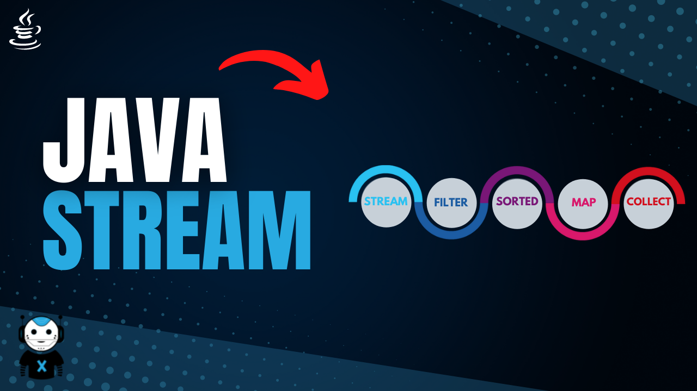

# java-stream

## Operações

### Intermediárias: 

 - distinct
 - filter
  - map 
 - peek
 - sorted
 - skip

### Short Circuit

 - limit
 - skip

### Terminais  
  
  - toArray
  - collect
  - count
  - reduce
  - forEach
  - forEachOrdered
  - min
  - max
  - anyMatch
  - allMatch
  - noneMatch
  - findAny
  - findFirst
